# Manual de usuario
## Notas para el despliegue
La práctica se ha desarrollado utilizando JDK 1.7. Por ello, para el correcto
funcionamiento en la máquina virtual es necesario asegurarse de que esta sea la versión activa:

- Ejecutar el comando `update-alternatives --config java` y seleccionar JDK 1.7

Además, la aplicación necesita más memoria de PERMGEN SPACE de Java de la que dispone Tomcat 7 con su configuración por defecto para ejecutarse correctamente. Para incrementarla:

- Crear el archivo `setenv.sh` en la ruta:
  
      /usr/share/tomcat7/bin

con el siguiente contenido:
  
      #!/bin/sh
      export JAVA_OPTS=”-Xms256m -Xmx1024m”

***Se ha comprobado que con esta configuración la aplicación se ejecuta correctamente en la máquina virtual proporcionada.***

## Inicio de la aplicación

La aplicación se encuentra disponible en la URL:

[http://localhost:8080/ped14](http://localhost:8080/ped14)

## Home pública

Una vez hayamos accedido a la aplicación se mostrará la página pública. En este caso, 
se muestran todos los currículums registrados en el sistema.

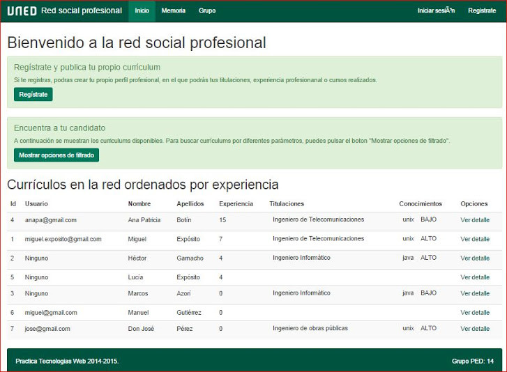

### Buscar currículos

Además, la aplicación ofrece la posibilidad de realizar un filtrado por varios campos. 
Para mostrar las opciones de filtrado, se debe hacer click en el bótón `Mostrar opciones 
de filtrado`. Una vez rellenados los parámetros de búsqueda, se debe pulsar el botón 
`Buscar`.

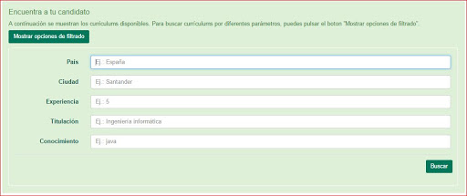

### Acceder a la información de un currículum

Una vez localizado un currículum mediante las opciones de búsqueda, podemos acceder a su
información detallada haciendo click en el enlace `Ver detalle`, disponible para cada 
una de las filas de la tabla de resultados.

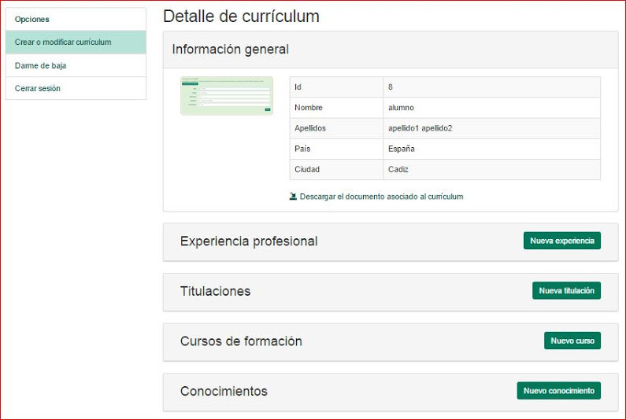

### Mostrar interés 

Cada currículum muestra la información agrupada en elementos. Para cada uno de ellos, es
posible mostrar interés, haciendo click en el icono correspondiente.

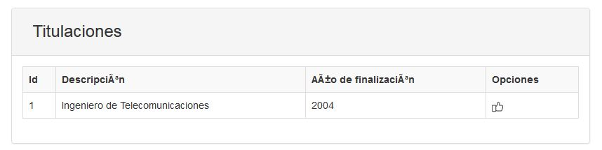

## Registro de nuevo usuario

La aplicación permite que un usuario visitante se registre. En este caso, dispondrá de 
su propia cuenta de acceso, y podrá crear su perfil profesional o currículum.

Para registrarnos como usuarios, podemos hacer click en el enlace `Regístrate`, disponible
en la cabecera de la página.

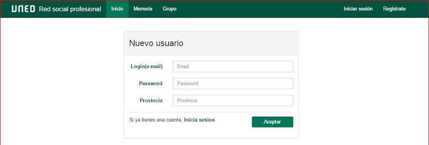

Para realizar el registro, se debe indicar en primer lugar el email, que se empleará como
nombre de usuario para iniciar sesión en la aplicación. A continuación debemos rellenar los
campos `Password` y `Provincia`, y pulsar el botón `Aceptar`.

## Inicio de sesión para usuarios registrados

Una vez nos hemos registrado, podemos emplear el nombre de usuario y contraseña elegidos
para iniciar sesión en la aplicación.

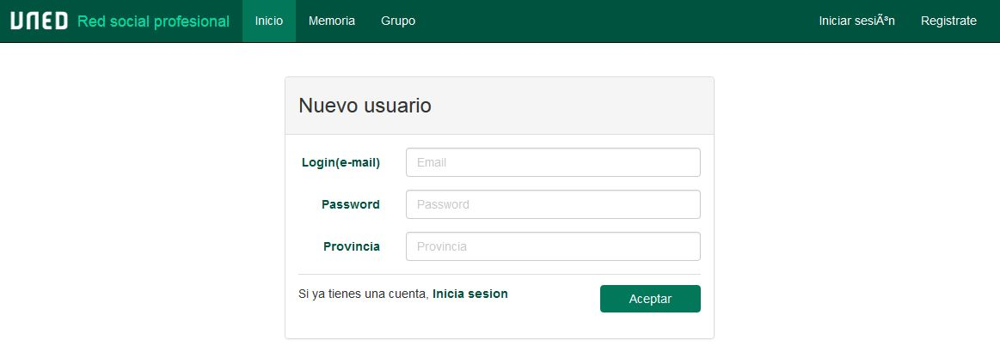

Para iniciar sesión, podemos hacer click en el enlace `Iniciar sesión`, disponible en la 
cabecera de la página.

## Usuarios registrados

Una vez hemos iniciado sesión como usuario registrado, la aplicación mostrará nuestro 
currículum si ya lo hemos creado anteriormente, o un mensaje indicando que aún no lo hemos
creado, con un botón que permite acceder a la página de creación de perfil profesional.

### Creación de nuevo perfil profesional o currículum

En esta página, podremos crear nuestro perfil. Para ello, rellenaremos los campos `Nombre`,
"Apellidos", "Ciudad" y "País". Opcionalmente, podemos añadir una imagen a nuestro perfil, 
así como un documento con su contenido.

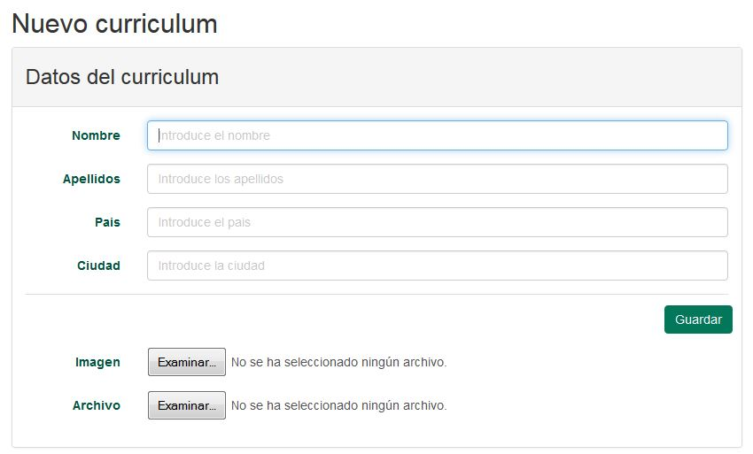

### Añadir nuevos elementos al currículum

La aplicación permite añadir nuevos elementos a un currículum, en el momento de su creación,
o posteriormente.

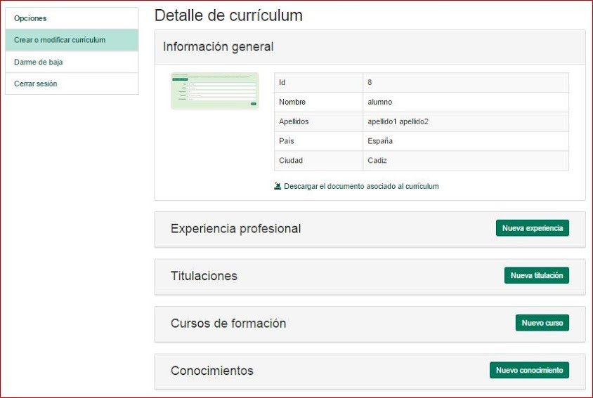

### Modificar elementos del currículum

Una vez creado un elemento, podemos modificarlo. En este caso, pulsaremos el botón `Editar`
sobre el elemento que deseemos cambiar.

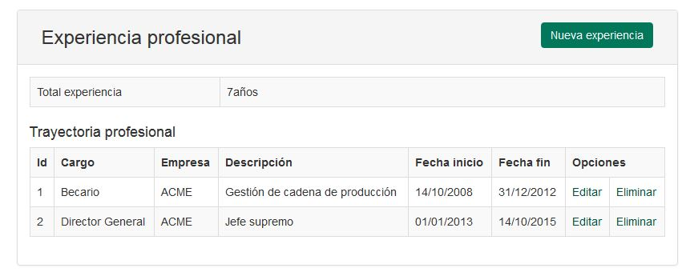

### Eliminar elementos del currículum

La aplicación permite eliminar elementos de un perfil profesional. Para ello, se debe pulsar
el enlace "eliminar" disponible en cada uno de las filas del elemento.

##Darse de baja

Los usuarios pueden darse de baja en el sistema, pulsando el enlace `Darme de baja`.

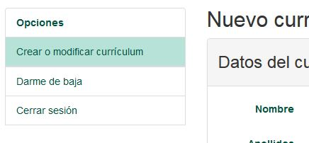

## Usuario administrador

### Habilitar y deshabilitar funcionalidades

El usuario administrador puede activar y desactivar funcionalidades para el resto de
usuarios. Para ello, debe pulsar la opción `Gestionar funcionalidades` y se ofrecerá
la posibilidad de habilitar o deshabilitar la creación, modificación o eliminación de
elementos

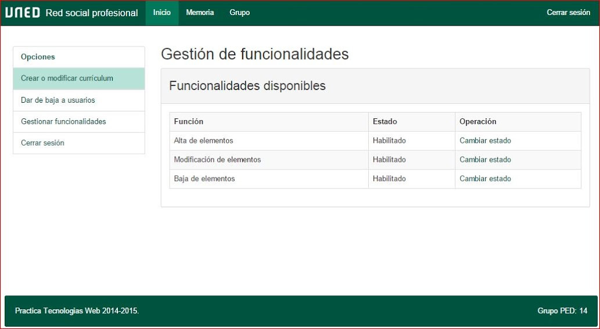

###Eliminar usuarios

Un usuario administrador puede eliminar cualquiera de los usuarios registrados en el sistema.
Para eliminar usuarios, debemos pulsar el botón `Dar de baja usuarios`.

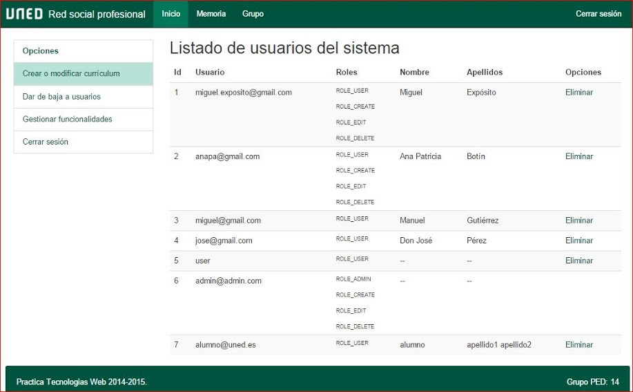

