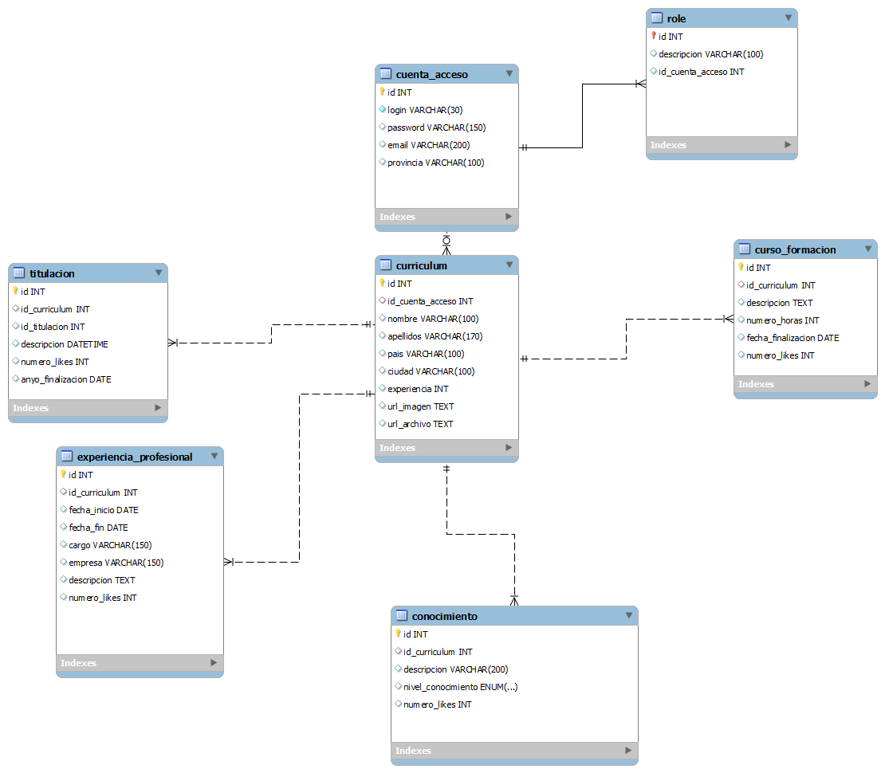
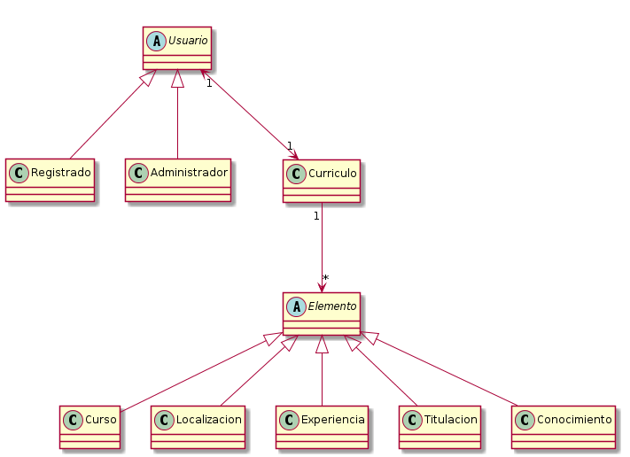
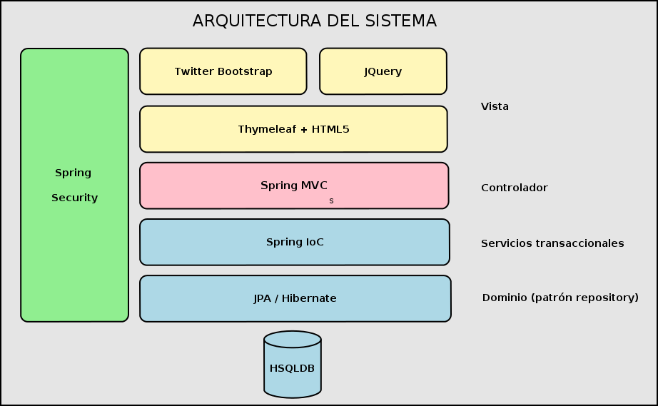

# Introducción

Los objetivos del grupo al abordar el presente trabajo han sido los siguientes:

- Dar cumplimiento a los requisitos especificados por el cliente.
- Definir una fórmula de trabajo colaborativo adecuada.
- Especificar un calendario de hitos realizable.
- Aplicar el uso de patrones de diseño que proporcionen una mayor eficiencia a la hora de implementar el sistema.
- Establecer y utilizar los mecanismos que permitan entregar una mínima garantía de calidad con el producto.
- Agilizar el desarrollo mediante la automatización de tareas repetitivas y tediosas, centrando el desarrollo en la entrega de valor.

En el presente documento, cuya fuente se encuentra disponible en formato Markdown con el proyecto, se ofrecerá una visión general sobre cómo se ha llevado a cabo el desarrollo del producto, incluyendo documentación sobre las distintas fases de su ciclo de vida (análisis, diseño, implementación y pruebas) y satisfaciendo de este modo los requisitos de documentación establecidos.

# Notas para el despliegue
La práctica se ha desarrollado utilizando JDK 1.7. Por ello, para el correcto funcionamiento en la máquina virtual es necesario asegurarse de que esta sea la versión activa:

- Ejecutar el comando `update-alternatives --config java` y seleccionar JDK 1.7

Además, la aplicación necesita más memoria de PERMGEN SPACE de Java de la que dispone Tomcat 7 con su configuración por defecto para ejecutarse correctamente. Para incrementarla:

- Crear el archivo `setenv.sh` en la ruta:
  
      /usr/share/tomcat7/bin

con el siguiente contenido:
  
      #!/bin/sh
      export JAVA_OPTS=”-Xms256m -Xmx1024m”

***Se ha comprobado que con esta configuración la aplicación se ejecuta correctamente en la máquina virtual proporcionada.***

# Composición del grupo y roles

## Miembros del grupo

- Héctor Garnacho García, 12398942X.
- Marcos Azorí, 53017273L.
- Miguel Expósito Martín, 72056097H.

## Matriz miembros/roles

Para la realización del proyecto se han asignado los siguientes roles basados en la experiencia y conocimientos de cada miembro del grupo:

|Rol|Marcos Azorí|Héctor Garnacho|Miguel Expósito |
|---|------------|---------------|----------------|
|Jefe de proyecto||X||
|Analista|X|X|X|
|Arquitecto|||X|
|Desarrollador||X|X|
|Integrador|||X|
|Validador|X|X||
|Documentador|X|X|X|

# Plan de trabajo

A continuación se incluye la propuesta inicial de calendario para el cumplimiento de hitos:

|Hito|Descripción|Fecha estimada |
|----|-----------|---------------|
|Hito 1| Esqueleto de proyecto montado|31/03/2015|
|Hito 2| Dominio de la aplicación completado|20/04/2015|
|Hito 3| Lógica de negocio completada|18/05/2015|
|Hito 4| Vistas maquetadas|1/6/2015|
|Hito 5| Pruebas y producto completo|15/06/2015|

## Hito 1

Comprende la elección e implementación de la infraestructura necesaria para llevar a cabo el proyecto. Se tendrán los siguientes entregables:

- Esqueleto del proyecto.
- Repositorio del proyecto en un sistema de control de versiones.
- Elección y configuración de la herramienta de construcción y gestión del ciclo de vida del proyecto.

## Hito 2

En el segundo hito se lleva a cabo un análisis y especificación de requisitos inicial, debiendo dar lugar a los siguientes entregables:

- Diagrama de casos de uso UML.
- Diagrama de modelo de datos.
- Código fuente de capa de persistencia.

## Hito 3

Definido el modelo, el siguiente paso es implementar la lógica de negocio en forma de servicios a partir de los requisitos capturados, debiendo dar lugar al siguiente entregable:

- Diagrama de clases UML.
- Código fuente de capa de servicios.

## Hito 4

Una vez implementados el modelo y la lógica de negocio, es necesario elaborar la maquetación de las vistas. Los entregables en esta fase serían:

- Código fuente de vistas y controladores.

## Hito 5

Finalmente, en el último hito se corrigen posibles deficiencias y elaboran las pruebas unitarias razonables para asegurar una mínima calidad del sistema. Asimismo, se prepara el producto para su despliegue. Los entregables de este hito serían:

- Producto completo.
- Tests unitarios y de integración que correspondan.
- Documentación asociada: memoria, manual de usuario, javadoc.

# Especificación de requerimientos

## Requisitos funcionales

Tabla 1. Identificación de requisitos funcionales
---------------------------------------------------------------------------------------
id      nombre            descripción
------- ----------------- -----------------------------------------------------------------
1       usuario anónimo   El sistema permitirá por defecto el acceso de usuarios anónimos a
                          una página de inicio que mostrará una interfaz de búsqueda.
2       parámetros de     La página de inicio permitirá realizar búsquedas por los siguientes
        búsqueda          parámetros: localización geográfica, experiencia profesional,
                          titulaciones y conocimientos de una determinada tecnología.
3       visualización de  El sistema permitirá a un usuario anónimo visualizar características
        características   de un determinado currículum encontrado mediante la interfaz de
                          búsqueda.
4       mostrar interés   El sistema debe permitir a los usuarios anónimos mostrar un interés
                          determinado por un elemento concreto del currículum (titulación...)
5       alta de usuairo   El sistema debe permitir a un usuario anónimo su alta en el sistema
                          a través de un formulario sencillo (nombre, contraseña, email,
                          provincia).
6       alta de elementos El sistema debe permitir añadir elementos al currículum de un usuario
                          registrado. Los detalles de dichos elementos deberán poder ser
                          consultados.
7       modificación de    El sistema debe permitir a un usuario registrado modificar los datos
        elementos         de los elementos que conforman su currículum.
8       baja de           El sistema debe permitir a un usuario registrado dar de baja elementos
        elementos         que conforman su currículum.
9       información de    La información asociada a los elementos deberá ser al menos la necesaria
        los elementos     para que funcionen los filtros de búsqueda. Opcionalmente, se podrá
                          incluir un documento.
10      perfil profesional El sistema deberá permitir a un usuario registrado elaborar un perfil
                          profesional con elementos que incluyan años de inicio y fin y cargo,
                          así como nombre de empresa y descripción breve.
11      perfil con foto    El sistema deberá permitir a un usuario registrado asociar una foto
                          a su perfil profesional.
12      baja del sistema  El sistema deberá permitir a un usurio registrado darse de baja en
                          el mismo.
13      administrador     Existirá un perfil administrador del sistema que podrá accer, entre
                          otras, al resto de funciones de los demás actores.
14      funciones de      El perfil administrador del sistema podrá habilitar o deshabilitar
        sistema           determinadas funciones como alta, modificación y baja de elementos.
                          Estando deshabilitadas, ningún usuario podrá utilizar dichas
                          funciones.
15      baja de usuarios  El perfil administrador del sistema podrá dar de baja a usuarios.

## Casos de uso

Tabla 2. Descripción de los casos de uso. Actor Visitante
---------------------------------------------------------------------------------------------
id      nombre              descripción                                     dependencias
------- ------------------  ----------------------------------------------- -----------------
1       Buscar currículum   El sistema permite buscar currículos por       Ninguna
                            diferentes criterios sin necesidad de iniciar
                            sesión.
2       Darse de alta       Los usuarios visitantes tienen la posibilidad   Ninguna
                            de registrarse en el sistema.
3       Visualizar          Una vez seleccionado un currículum concreto,    Buscar
        características     el usuario invitado puede visualizar los datos  Currículum
                            asociados (Imagen del usuario, información 
                            general, titulaciones, experiencia profesional,
                            cursos realizados o conocimientos).
4       Mostrar interés     Si una de las características del Currículum    Visualizar
                            seleccionado es del interés del visitante,      Currículum
                            puede indicarlo hacienco click en un enlace.
                            El numero de veces que se muestra interés se
                            almacena en el sistema.

Tabla 3. Descripción de los casos de uso. Actor Registrado
---------------------------------------------------------------------------------------------
id      nombre              descripción                                     dependencias
------- ------------------  ----------------------------------------------- -----------------
1       Elaborar perfil     Los usuarios registrados pueden iniciar sesión  Darse de alta
                            en el sistema, y crear su propio perfil 
                            profesional o currículum.
2       Alta                Una vez creado el perfil, el usuario puede      Elaborar perfil
        elementos           añadir nuevos datos a los elementos que forman
                            su currículum.
2       Modificar           El usuario puede modificar todos los elementos  Elaborar perfil
        elementos           asociados su perfil profesional, una vez
                            creado.
3       Baja elementos      Además de poder modificar los elementos, el     Elaborar perfil
                            usuario registrado puede eliminar aquellos 
                            que considere oportunos.     
4       Dar de baja         Un usuario registrado puede cancelar su cuenta  Darse de alta
                            de acceso. A partir de ese momento, no podrá 
                            acceder a la aplicación.                                             

El actor administrador puede realizar las mismas funciones que los dos actores anteriormente descritos; por
lo tanto, a continuación se describen únicamente aquellas que son específicas de este perfil.

Tabla 4. Descripción de los casos de uso. Actor Administrador
---------------------------------------------------------------------------------------------
id      nombre              descripción                                     dependencias
------- ------------------  ----------------------------------------------- -----------------
1       Activar          Un usuario administrador puede activar funciones   Ninguna
        funciones        para los usuarios de la aplicación. Las funciones
                         que puede activar son las siguientes: Alta de 
                         elementos, modificación de elementos y baja de
                         elementos. 
2       Desactivar       Un usuario administrador puede desactivar las     
        funciones        mismas funciones descritas en el apartado anterior Ninguna
                         para los usuarios de la aplicación.
3       Dar de baja a    Un usuario administrador puede dar de baja a       Ninguna
        usuarios         cualquier otro usuario del sistema.

# Esquema de base de datos

## Consideraciones de diseño

Para simplificar el modelado del sistema, se han tomado las siguientes decisiones de diseño:

- Evitar, en la medida de lo posible, las relaciones `many-to-many`. Su tratamiento es complejo usando `frameworks` de persistencia, y la experiencia de muchos diseñadores indica que se agiliza el desarrollo si en su lugar se utilizan tan sólo relaciones `one-to-many`. Además, en el caso concreto de esta aplicación, dada la gran variedad de realizaciones de entidades que podrían darse (cursos y titulaciones con nombres de lo más variopintos), la posible ganancia obtenida de su normalización sería mínima en comparación con la dificultad entrañada.
- Utilizar búsquedas de tipo `like`: dado que no se especifican requisitos técnicos acerca del tipo de búsquedas, se optó por implementar la solución más simple (búsqueda de una cadena de texto en cualquier posición dentro de otra). En futuras iteraciones de mantenimiento evolutivo del sistema podría contemplarse el uso de Hibernate Search, que permite realizar búsquedas *fulltext* mucho más potentes.
- Utilizar enumeraciones para los tipos más simples: en concreto, para modelar los niveles de conocimiento (alto, medio, bajo).

## Dominio de la información

El dominio de la información asociada al sistema se compone de las siguientes entidades:

- **Usuario**: representa un usuario del sistema. Fundamentalmente almacena información sobre login (correo electrónico) y provincia a la que pertenece. Presenta una asociación `one-to-one` con currículum.
- **Currículum**: entidad principal que modela los datos asociados a un currículum de un usuario (nombre, apellidos, archivos...). Presenta asociaciones `one-to-many` con los elementos que lo componen (experiencia, titulaciones, cursos, conocimientos...)
- **Experiencia profesional**: entidad que modela las experiencias profesionales asociadas a un currículum, pudiendo especificarse sus fechas de inicio y de fin. La lógica de negocio se encargará de calcular la experiencia total.
- **Titulación**: entidad que modela las posibles titulaciones asociadas a un usuario. Texto libre y un campo con el año de finalización.
- **Conocimiento**: entidad que modela los posibles conocimientos asociados a un usuario. A su vez presentan un campo "nivel de conocimiento" (una enumeración con valores posibles medio, bajo y alto).
- **Curso de formación**: entidad que representa los posibles cursos de formación asociados a un usuario o currículum.

A partir de este dominio de información se genera toda la estructura por capas de la aplicación, estableciéndose una nomenclatura estándar de este tipo: `ClaseCapa.javadoc` (ejemplo: `CurriculumController.java`)

En los anexos se incluye una figura con el diagrama de modelo de datos y un diagrama de clases.

#Arquitectura

La arquitectura del sistema se define teniendo presente el patrón DRY (Don't Repeat Yourself). Se seleccionó un arquetipo Maven con una integración adecuada de distintos frameworks según la capa concreta del patrón MVC (Modelo - Vista - Controlador).

Para gestionar el ciclo de vida del proyecto así como su construcción se seleccionó la herramienta Maven, que permite, mediante sencillos comandos, llevar a cabo las siguientes tareas:

- Ejecución de la aplicación en un contenedor Tomcat 7 empotrado.
- Ejecución de pruebas unitarias y de integración.
- Construcción de un WAR para desplegar en otro contenedor.
- Gestionar las dependencias de bibliotecas mediante un repositorio sencillo.

El arquetipo Maven seleccionado es un proyecto abierto relativamente conocido que puede descargarse aquí:

[https://github.com/kolorobot/spring-mvc-quickstart-archetype](https://github.com/kolorobot/spring-mvc-quickstart-archetype)

Para poder utilizar el arquetipo con la configuración de plataforma especificada en los requisitos técnicos se tuvieron que hacer ciertos cambios que permitieran su ejecución con la plataforma Java EE 1.7. A partir de dicho arquetipo se confeccionó un esqueleto para el desarrollo del sistema que se subió a un repositorio de código fuente gratuito (Github), pudiendo consultarse aquí:

[https://github.com/predicador37/PED14](https://github.com/predicador37/PED14)

Dicho repositorio conforma la solución colaborativa utilizada por el grupo de desarrollo. En su página principal se encuentra información somera sobre las características del proyecto y documentación sobre el proceso de envío e intercambio de código, así como de construcción y pruebas del software.

La arquitectura del sistema consta de las siguientes capas:

### Modelo

Capa que contiene el modelo del dominio de la información, con las subcapas de acceso a datos (patrón Repository, en este caso) y lógica de negocios (POJOs y servicios). Para el modelo se utilizan los siguientes frameworks o tecnologías de apoyo:

#### Dominio

- POJOs: *Plain Old Java Objects*, para modelar las entidades básicas que se mapean con tablas en la base de datos. Contienen también parte de la lógica de negocio, que será encapsulada posteriormente en repositorios y a su vez en servicios. Su nomenclatura es la siguiente: 

    - `Clase.java` (ej.: `Curriculum.java`)

#### Acceso a datos

- JPA (Java Persistent Access) y su implementación Hibernate: proporcionan el acceso a datos a través del patrón *repository*. Como añadido, se ha utilizado la biblioteca `spring-data` para generar los métodos CRUD (Create - Read - Update - Delete) típicos en todas las entidades. Su nomenclatura es la siguiente:

    - `ClaseRepository.java` (ej.: `CurriculumRepository.java`), si el repositorio no extiende `spring-data`.
    - `ClaseRepositoryInterface.java` (ej.: `CurriculumRepositoryInterface.java`), si el repositorio extiende `spring-data` y permite aprovechar sus métodos CRUD.

Dentro de los repositorios están incluidos los métodos de tipo *finder*, que permiten realizar búsquedas por parámetros y recuperar listados de entidades.

### Lógica de negocio

- Spring: framework "aglutinador" cuya característica principal es la **inversión de control** (IoC), que permite inyectar dependencias en las clases. Además, `Spring` garantiza la transaccionalidad en la definición de los distintos servicios que encapsulan la mayor parte de la lógica de la aplicación. Su nomenclatura es la siguiente:

    - `ClaseService.java` (ej.: `CurriculumService.java`)

Dentro de los servicios suelen estar incluidos también los métodos de tipo *finder*, que permiten realizar búsquedas por parámetros y recuperar listados de entidades.
    
### Controlador

Capa que recibe las peticiones de las vistas y llama a los servicios que encapsulan la lógica de negocio para realizar ciertas operaciones y devolver los resultados en forma de vistas al usuario. Para implementar la capa de controlador se ha utilizado Spring MVC, un framework moderno (sucesor de Struts) que se integra fácilmente con el resto de tecnologías utilizadas en la arquitectura de la aplicación. Su nomenclatura es la siguiente:

    - `ClaseController.java` (ej.: `CurriculumController.java`)

### Vista

Capa que constituye la frontera de interacción con el usuario, que le permite enviar sus peticiones a la capa de controlador y recibir información procesada. Para implementar la vista se han utilizado las siguientes tecnologías:

- Thymeleaf: framework de plantillas basado en HTML5 que se integra de forma nativa con Spring MVC, permitiendo características como el renderizado de HTML, validación, interacción con capas de seguridad, etc.

- Twitter Bootstrap: framework CSS que permite construir de forma sencilla una interfaz adaptable (`responsive`) para la aplicación, con estilos familiares y conocidos por la mayor parte de los usuarios de aplicaciones web.

- JQuery: framework javascript que permite dotar a la aplicación de funcionalidades de interfaz avanzadas así como interacciones asíncronas con el servidor (AJAX).

Las vistas se estructuran de la siguiente manera:

- Recursos dinámicos: en directorios del tipo `view/clase/accion` (ej.: `view/curriculum/create`)
- Recursos estáticos: en directorios del tipo `resources/recursos` (ej. `resources/css/custom.css`)

### Seguridad

Finalmente, para ofrecer garantías de seguridad se utilizó el conocido framework Spring Security, que soluciona problemas de autenticación y autorización de usuarios. En este caso, se han mapeado las funciones de Spring Security con clases del dominio (usuarios y roles), permitiendo implementar también los requisitos asociados de activación y desactivación de funcionalidades.

Además, Spring Security protege también contra ataques de inyección SQL y *cross-site scripting* (XSS), entre otros.

## Componentes

Al tratarse de un diseño orientado a dominio, los componentes se pueden modelar a través de paquetes de clases. En concreto, cada paquete contendría una o varias clases por cada capa descrita de la aplicación. Existirán también algunos componentes auxiliares y otros generales de configuración. El listado de componentes resumido sería el siguiente:

- `account`: funcionalidad asociada a las cuentas de usuario y sus roles.
- `conocimiento`: funcionalidad asociada a la entidad conocimiento.
- `curriculum`: funcionalidad asociada a la entidad principal currículum.
- `curso`: funcionalidad asociada a la entidad que modela los cursos de formación.
- `experiencia`: funcionalidad asociada a la entidad que modela la experiencia profesional.
- `titulacion`: funcionalidad asociada a la entidad que modela las titulaciones.
- `home`: gestión de la página de inicio.
- `config`: configuración de distintos frameworks.
- `error`: gestión de errores y excepciones en general.
- `admin`: funcionalidad asociada a los usuarios administradores.
- `siginin`: gestión del inicio de sesión de un usuario.
- `signup`: gestión del registro de un usuario.
- `support.web`: clases ayudantes para el tratamiento de mensajes.

## Resumen de arquitectura

En los anexos se incluye una figura con el resumen de la arquitectura utilizada.

#Guía de usuario

Se adjunta como el documento anexo [manual.pdf](./manual.pdf).

#Conclusiones
Del desarrollo del sistema propuesto se extraen las siguientes conclusiones:

- Es difícil encontrar arquetipos estándar que sirvan de esqueleto para el desarrollo rápido de aplicaciones, especialmente utilizando bases de datos residentes en memoria como HSQLDB.
- El uso de distintos frameworks de desarrollo para las distintas capas del sistema simplifica la implementación pero complica la configuración, dadas las prácticamente infinitas posibilidades existentes.
- Existen ciertas tareas básicas que se complican utilizando frameworks; por ejemplo, la integración de Thymeleaf con Spring MVC hace prácticamente imposible el almacenamiento de un valor nulo en un campo fecha de la base de datos. Si bien parece una tarea trivial, lo cierto es que no lo es.
- Las relaciones `many-to-many` con atributos extra requieren del uso de clases intermedias (asociadas con sendas `one-to-many` a las dos entidades en cuestión, complicando el diseño y la implementación sobremanera.
- Es muy difícil cumplir con un calendario propuesto teniendo en cuenta las diversas circunstancias de los miembros de un equipo de desarrollo, que hacen que el tiempo disponible sea más bien escaso e insuficiente.
- Las pruebas unitarias y de integración son herramientas muy útiles para evitar errores de regresión y aumentar la confianza y seguridad en la corrección del código desarrollado.
- Las herramientas de gestión del ciclo de vida del proyecto permiten automatizar tareas de otra forma tediosas, aumentando considerablemente la productividad del desarrollador.
- Los lenguajes de etiquetas sencillos, como Markdown, permiten generar documentos con apariencia profesional conservando todos los beneficios del uso de texto plano.
- En general, como última conclusión, este grupo de desarrollo se opina que trabajar con un ecosistema de tecnologías tan variado como es el de JEE es complicado, dado que si no se dispone de usuarios expertos en cada capa el tiempo de desarrollo aumenta y, por el contrario, si sólo se tienen usuarios expertos en cada capa es difícil llevar a cabo la integración de dichas tecnologías. Se trata de un mosaico demasiado disperso, difícil de manejar.

#Anexos

